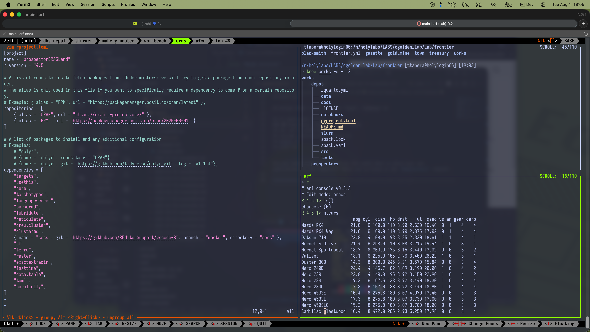

## Why HPC is the lab default

Harvard University's computing cluster is called FASRC (Faculty of Arts 
and Sciences Research Computing), and is one of the largest, most powerful
compute clusters on the East Coast. It provides scalable computing
resources, secure environments for sensitive data, and a shared infrastructure that supports collaboration and reproducibility.
As discussed in [Principle 1](../01_orientation/start-here.qmd#sec-principle1), 
we treat HPC as the default environment for data science in the lab. If
your project works on HPC, it is more likely to be reproducible, shareable, 
and scalable. If it only works on your local machine, which only has
settings and configurations specific to you, it is more likely to 
break when you or someone else tries to run it again in the future.
By working this way, we intentionally introduce a _small_ amount of friction
upfront, to save a lot of time and headache in the future.

But don't let that intimidate you! The FASRC team has done a great job of 
making the cluster accessible and user-friendly, and there are many ways to 
interact with it that require close to zero setup or expertise. The goal of 
this guide is to help you find the right access path for your needs, and to 
give you some practical tips and examples for working on HPC.

## Some Lingo

Let's clear the air of some jargon that you might encounter when working 
with HPC:



Another confusing collection of jargon is the interchangeable use of
environments, software, and modules. Let's clarify these for this discussion:

- **Software**: The actual programs and tools that you use to do your work, 
such as R, Python, or specific packages. For example, R version 4.2.0 is a 
piece of software.

- **Modules**: A system for managing software on HPC clusters. Modules allow 
you to load and unload specific versions of software and their dependencies. 
For example, you might run `module load R/4.2.0` to load R version 4.2.0 and 
its associated libraries into your environment.

- **Computing Environment**: The overall setup of your computing context, including 
the hardware, operating system, software packages, and modules that are available to 
you. For example, the Cannon cluster is an environment, and the FASSE 
cluster is a different environment with different security settings and 
software availability.

- **Virtual Environment**: A self-contained directory that contains a specific
version of (usually) Python and its associated packages. Virtual environments allow you 
to create miniature, isolated environments for different projects, so that you can manage
dependencies and avoid conflicts between packages.

- **Environment _variables_**: These are key-value pairs that are set in 
your shell and can be accessed by your programs. They often contain 
configuration settings, such as paths to software or proxy settings.
Importantly, environment variables are "set" by the shell when it starts,
are specific to the user who starts the shell, and are inherited by any 
processes that are started from that shell. They are not global settings for 
the cluster, but rather specific to you your session. For example, when I log
into the cluster, my shell automatically sets environment variables that 
point to the R and Python installations, and I can also set my own 
environment variables for things like proxy settings or custom paths.
These settings are made in the file `~/.bashrc`, which you can
modify to create a customized environment. Take a moment to look at
your own environment variables by running `env` in your shell, to see what 
is set by default, and `cat ~/.bashrc` to see your customizations. Furthermore,
by using a _virtual_ environment, you can create project-specific environment 
variables which can be different from the global environment variables 
set by the shell, for example if you need a specific version of Python for
a particular project.

:::{.callout-tip}
For your purposes, "Software" refers broadly to the programs and tools you use, 
"Modules" are the FASRC-managed software packages you load, "Computing Environment" 
is the overall context of your work on HPC, and "project environment,"
is the specific configuration of software and settings that your local 
project relies on to run successfully.
:::

## Interface

We recommend two main interfaces for working on FASRC: Open OnDemand (OOD) 
and VSCode[^interfaces]. OOD is a web-based interface that provides access to interactive 
apps like RStudio Server, Jupyter, and Matlab, as well as file browsing and 
job submission tools. VSCode is a powerful code editor that can connect to 
the cluster via SSH, allowing you to edit files, run commands, and manage 
your code directly from your local machine. Both interfaces have their 
strengths and weaknesses, and the best choice depends on your specific needs 
and preferences.

[^interfaces]: There is technically a third interface, which is barebones command-line access via SSH. This is the most basic way to interact with 
the cluster. However, we recommend using OOD or 
VSCode for most interactive work, as they provide a more user-friendly 
experience and better support for code editing and project management.
Doing so purely via SSH is possible, but requires strong familiarity with
the command-line, and doesn't really provide any advantages over the other 
two options unless you're really proficient, and that comes with time and experience.

## Choose the right access path

::: {.panel-tabset}

## VSCode Remote SSH

Have you ever wanted to have all of the convenience of VSCode on your local machine, 
but have it actually execute your code on the cluster? This is possible with the
Remote - SSH extension for VSCode. It allows you to connect your local VSCode to a
remote server (in this case, the FASRC cluster) via SSH, and run your code in 
that environment. This means that you can edit files, run commands, and manage 
your code directly from your local machine, while still taking advantage of 
the powerful computing resources of the cluster.

Check out the [Remote-SSH guide](vscode-remote-ssh.qmd) to learn how to set it 
up and use it effectively!

## Open OnDemand (OOD)

🚦🚧 This section is under construction 🚧🚦

Ultimately, this is just submitting a job that you interact with through the 
browser.

## Command-Line Only

If you prefer to work entirely from the command line, you can connect to 
the FASRC cluster via SSH and use the command-line interface to navigate, 
edit files, and submit jobs. Doing so requires familiarity with the command-line, 
and for beginners is going to feel like _a lot_ of friction. However, as you
improve your dexterity and memory, you'll find a turning point where the 
command line is actually faster than any GUI or IDE, and you can do things 
that are actually impossible in VSCode. For example, you can use `grep` to search 
through thousands of files in seconds, or use `awk` to manipulate data on the fly.

The command-line interface is also more flexible and customizable, allowing 
you to create scripts and automate tasks, customize the look, feel, and navigation
of your shell, and build or install awesome tools and helpers to make your
every day work just that much more efficient.

Investing in command-line mastery is a long-term investment that pays off 
in the end, and is a skill that will serve you well in any computing 
environment, not just HPC. However, for most users, we recommend using the
command-line in conjunction with OOD or VSCode, rather than as the sole interface.

🚦🚧 This section is under construction 🚧🚦 
Open our [Command Line guide]() to start building your command-line skills, 
and learn how to use the command-line interface effectively on FASRC.
:::

